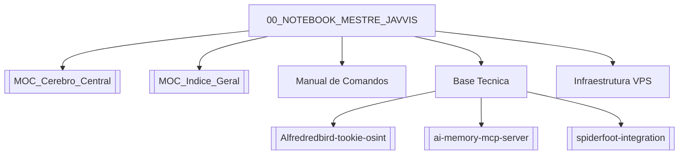

# 00 — Notebook Mestre JAVVIS

> Memória unificada do bot Hermes/JAVVIS: comandos, conhecimento técnico, infraestrutura e conexões do vault Obsidian.
> Gerado automaticamente em **2026-06-27 10:44 UTC**.

**Hubs:** [[MOC_Cerebro_Central]] · [[MOC_Indice_Geral]] · [[bootstrap]] · [[_HOME]]

---

## 1. Manual de Comandos

Varredura dinâmica de `bot.py` — **118 comandos** detectados.
Menu vivo via `/help` (gerado por `_build_dynamic_help_text()`).

Comandos disponiveis (varredura automatica do bot.py):

🤖 IA e Analise:
/aprender_repo <url_github> - Baixa README e salva em memory/learned_repos
/index_repo <url_github|local> - Indexa repositorio no grafo codebase-memory-mcp
/repo_analyze <url_github> - Analisa repositorio GitHub
/repo_analyze_help - Ajuda do analisador de repositorios
/repo_install_plan <url_github> - Plano de instalacao/integracao
/repo_compare <url1> <url2> - Compara dois repositorios GitHub
/repo_ranking - Ranqueia repos analisados para evolucao da arquitetura
/repos - Lista historico de repositorios analisados
/repo_review <url_github> - Revisa repositorio GitHub
/repo_to_prompt <url_github> - Gera prompt a partir de repo GitHub
/repo_to_prompt_short <url_github> - Gera prompt curto de repo GitHub
/repo_apply_short - Aplica prompt curto de repo
/channel_analyze <url> - Analisa canal Telegram/YouTube
/channel_analyze_help - Ajuda do analisador de canais
/channel_debug - Debug do analisador de canais
/analisar - Alias de /channel_analyze
/noticias_ai - Busca noticias recentes de IA
/noticias_ia - Alias de /noticias_ai
/ia_news - Alias de /noticias_ai
/news_ai - Alias de /noticias_ai
/noticias_ai_audio - Noticias de IA em audio
/noticias_ia_audio - Alias de /noticias_ai_audio
/ia_news_audio - Alias de /noticias_ai_audio
/news_ai_audio - Alias de /noticias_ai_audio
/akita - Ultimas postagens AkitaOnRails em podcast monologo
/ipcheck <ip_ou_dominio> - Varredura OSINT passiva (SpiderFoot)
/osint <alvo> - Inteligencia OSINT (subdominios, emails, tecnologias)
/attack_surface <alvo> - Superficie de ataque (portas, SSL, buckets)
/verificar_hack <url_tweet> - Analisa tweet suspeito de comprometimento
/langgraph_test [texto] - Valida orquestracao LangGraph com checkpoints
/resumo_hoje - Resumo executivo das alteracoes de hoje
/analisar_chat [foco] - Analisa historico desta conversa
/consultar_memoria <pergunta> - Busca e resume notas em Memoria_Agente
/youtube <link> - Extrai transcricao e gera relatorio de aprendizado
/persona_youtube <link> - Clona personalidade do locutor via YouTube
/grok <tarefa> - Executa tarefa via Grok CLI
/gemini_pdf <link> - Extrai conversa Gemini e gera PDF/MD
/pdf_gemini - Alias de /gemini_pdf
/login_gemini - Autentica Gemini colando cookies no chat
/login_gemini_link - Login Gemini via link OAuth
/login_gemini_browser - Login Gemini via Playwright
/set_gemini_cookie <cookie> - Define cookie Gemini manualmente
/last30days <tema> - Tendencias dos ultimos 30 dias
/last30days_sources <tema> - Fontes do last30days
/last30days_help - Ajuda do last30days
/last30days_debug <tema> - Debug do last30days
/obsidian_clean - Higieniza cofre Obsidian (WikiLinks e MOC)
/cerebro_sync - Sincroniza cerebro/memoria do agente

🌐 Agent-Reach:
/agent_status - Status do Agent-Reach
/x <consulta> - Pesquisa Twitter/X via Agent-Reach
/reddit <consulta> - Pesquisa Reddit via Agent-Reach
/github <consulta> - Pesquisa GitHub via Agent-Reach
/news <consulta> - Pesquisa noticias via Agent-Reach
/trend <consulta> - Pesquisa tendencias via Agent-Reach

🐦 Twitter/X:
/twitter_feed_start - Inicia feed de tweets
/twitter_feed_done - Finaliza feed
/twitter_feed_cancel - Cancela feed
/twitter_search <termo> - Busca tweets
/twitter_search_prompt <termo> - Busca tweets e gera prompt
/twitter_profile @usuario - Analisa perfil Twitter
/twitter_to_prompt - Gera prompt a partir de tweets
/twitter_similar @usuario - Busca contas similares
/twitter_learn @usuario - Aprende estilo de conta Twitter
/twitter_accounts_list - Lista contas monitoradas
/twitter_accounts_add @usuario - Adiciona conta monitorada
/twitter_accounts_clear - Limpa contas monitoradas
/twitter_examples - Exemplos de uso Twitter

📓 NotebookLM:
/nlm - Ajuda do NotebookLM
/notebooklm - Alias de /nlm
/nlm_login - Autenticar no NotebookLM
/nlm_status - Status da autenticacao NotebookLM
/nlm_cookies <cookies> - Autenticar NotebookLM com cookies
/notebooklm_login - Alias de /nlm_login
/notebooklm_status - Alias de /nlm_status
/notebooklm_cookies - Alias de /nlm_cookies

🔧 Sistema:
/start - Inicia o bot
/help - Mostra esta ajuda
/commands - Mostra esta ajuda
/modelos - Mostra modelos configurados
/reset - Reinicia sessao
/id - Mostra seu chat_id
/diag - Diagnostico do sistema
/api <nome> <api_key> [base_url] [modelo] - Configura API automaticamente
/api_list - Lista APIs configuradas
/api_status - Status das APIs
/api_add - Adiciona provider de API
/api_test - Testa provider de API
/api_detect - Detecta providers disponiveis
/api_use - Seleciona provider ativo
/api_use_simple - Usa provider leve
/api_use_heavy - Usa provider pesado
/api_remove - Remove provider
/api_default - Restaura provider padrao
/aplist - Alias de /api_list
/apistatus - Alias de /api_status
/apireg - Alias de /api_add
/apistud - Alias de /api_add
/apitester - Alias de /api_test
/apiteste - Alias de /api_test
/tocar - Alias de /api_use_simple
/tocar_pesado - Alias de /api_use_heavy
/tocar_padrao - Alias de /api_default
/status_api - Health-check da API ativa (latencia)
/statusapi - Alias de /status_api
/modo api|local|auto - Alterna roteamento API/LOCAL/AUTO
/openrouter_free - Lista modelos free do OpenRouter
/openrouter_limite - Testa limite de uso OpenRouter
/memoria - Resumo da memoria persistente
/buscar_memoria <termo> - Busca na memoria persistente
/lembrar <texto> - Salva texto na memoria persistente
/cancelar - Cancela operacao em andamento
/exec <comando> - Executa comando shell (admin)
/logs_start - Inicia captura de logs
/logs_done - Finaliza captura de logs
/logs_cancel - Cancela captura de logs

📋 Kanban:
/kanban - Gerencia tarefas Kanban

💻 Shell (autorizados):
/shell <comando> - Executa comando shell (autorizados)
/cmd <comando> - Executa comando shell (autorizados)

### Notas operacionais

- Comandos podem existir no código mas ficar invisíveis se o router não estiver ligado → [[router-wiring-can-hide-existing-commands]]
- Superfície histórica do bot → [[telegram-bot-command-surface]]
- Feedback de progresso em tarefas longas → [[Progress_feedback_Telegram_terminal]]

---

## 2. Base de Conhecimento Técnica

### 2.1 Repositórios analisados recentemente

| Repositório | Nota | Veredito | Data |
|-------------|------|----------|------|
| `arxhr007/Aliens_eye` | 12/100 | baixa prioridade | 2026-06-26 21:14 UTC |
| `ShadowHackrs/gmail-account-creator` | 12/100 | baixa prioridade | 2026-06-26 21:20 UTC |
| `DeusData/codebase-memory-mcp` | 40/100 | vale testar isolado | 2026-06-27 08:27 UTC |
| `telegram-hermes-freebot` | 45/100 | análise profunda | 2026-06-27 09:44 UTC |
| `Alfredredbird/tookie-osint` | 65/100 | análise profunda | 2026-06-27 09:54 UTC |

### 2.2 Tookie-OSINT (`Alfredredbird/tookie-osint`)

- **Nota técnica:** 65/100 — análise profunda (2026-06-27)
- **Arquitetura:** monolítico com modularização funcional (`modules/`, `lang/`, `config/`)
- **Projeto indexado no grafo:** `home-ubuntu-telegram-hermes-freebot-cache-codebase_repos-Alfredredbird-tookie-osint`
- **Valor para o Hermes:** módulo OSINT complementar a SpiderFoot; varredura de usernames/plataformas
- **Recurso no vault:** [[Alfredredbird-tookie-osint]]

### 2.3 codebase-memory-mcp (`DeusData/codebase-memory-mcp`)

- **Nota técnica:** 40/100 — vale testar isolado (2026-06-27)
- **Função:** servidor MCP que indexa repositórios em grafo persistente (tree-sitter, SQLite, busca estrutural/semântica)
- **Integração ativa no Hermes:** `/index_repo`, `hermes-intel search`, binário em `~/.local/bin/codebase-memory-mcp`
- **Comando relacionado:** `/index_repo <url_github|local>`
- **Conceitos:** [[ai-memory-mcp-server]] · [[langgraph-stateful-agents]]

### 2.4 Hermes-freebot (auto-análise local)

- **Nota:** 45/100 — análise profunda do próprio bot (2026-06-27)
- **Modo:** `deep` via `/repo_analyze local`
- **Timeline do dia:** [[resumo-hoje-e-195033]]

### 2.5 OSINT e SpiderFoot

- Engine passiva integrada: `/ipcheck`, `/osint`, `/attack_surface`
- PM2: `spiderfoot-web` (online)
- Conceito: [[spiderfoot-integration]]

### 2.6 Decisões arquiteturais relevantes

- [[0001-guard-startup-with-venv-and-single-instance-protection]]
- [[0002-use-fail-safe-disablement-for-missing-repo-analyze]]
- [[0003-expose-ai-memory-remotely-with-layered-access-controls]]

---

## 3. Infraestrutura — VPS Bluesminds

### 3.1 Hardware e SO

| Recurso | Valor |
|---------|-------|
| **RAM total** | {mem[1]} (disponível ~{mem[6]}) |
| **Swap** | 4.0 GiB |
| **Disco /** | {disk[1]} usado de {disk[0]} ({disk[4]} uso) |
| **Hostname** | `platonvps-3138-1779887504` |
| **Kernel** | Linux 6.8.0-124-generic (Ubuntu) |
| **IP público** | `187.84.150.241` |

### 3.2 Caminhos críticos

| Caminho | Função |
|---------|--------|
| `/home/ubuntu/telegram-hermes-freebot/` | Raiz do projeto (`PROJECT_DIR`) |
| `bot.py` | Router principal do Telegram bot |
| `.venv/` / `venv/` | Ambiente Python (PM2 usa `venv/bin/python`) |
| `cache/` | Offsets Telegram, memória curta, cookies NLM, locks |
| `memory/` | Histórico repo_analyze, erros, learned_repos |
| `obsidian_vault/` | Cofre Obsidian sincronizado |
| `Memoria_Agente/` | Memória estruturada ai-memory / MCP local |
| `config/` | Registries de API, MCP, credenciais auxiliares |
| `~/.notebooklm-mcp-cli/profiles/default` | Perfil NotebookLM autenticado |
| `~/.local/bin/codebase-memory-mcp` | Binário grafo de código |
| `~/.local/bin/nlm` | CLI NotebookLM (fallback) |

### 3.3 Processos PM2 (online)

| Processo | Função |
|----------|--------|
| `telegram-bot` | Bot JAVVIS/Hermes (`bot.py`) |
| `spiderfoot-web` | UI/engine OSINT SpiderFoot |
| `gemini-oauth` | Serviço OAuth Gemini |

### 3.4 Integrações ativas

- **NotebookLM:** `/nlm`, `/nlm_cookies`, `/nlm_status` — 27 notebooks detectados
- **Gemini:** `/login_gemini*`, `/gemini_pdf`
- **Agent-Reach:** `/x`, `/reddit`, `/github`, `/news`, `/trend`
- **Grok CLI:** `/grok`
- **LangGraph:** `/langgraph_test` → [[Hermes_LangGraph]]

---

## 4. Memória Operacional do Bot

- Memória curta: `cache/memory.json`, `cache/persistent_memory.json`
- Memória longa Obsidian: `obsidian_vault/10_Projetos/Memoria_Agente/`
- Sincronização neural: `/cerebro_sync`, `/obsidian_clean`
- Consulta RAG: `/consultar_memoria <pergunta>`
- Gotcha truncamento: [[memory-file-truncation]]
- Git + Obsidian: [[verificacao-pos-fix-obsidian-git]]

---

## 5. Grafo de Conexões ({connections} notas)

- [[MOC_Cerebro_Central]]
- [[MOC_Indice_Geral]]
- [[bootstrap]]
- [[telegram-bot-command-surface]]
- [[spiderfoot-integration]]
- [[repository-analysis-and-daily-summary]]
- [[ai-memory-mcp-server]]
- [[langgraph-stateful-agents]]
- [[Alfredredbird-tookie-osint]]
- [[resumo-hoje-e-195033]]
- [[0001-guard-startup-with-venv-and-single-instance-protection]]
- [[0002-use-fail-safe-disablement-for-missing-repo-analyze]]
- [[0003-expose-ai-memory-remotely-with-layered-access-controls]]
- [[router-wiring-can-hide-existing-commands]]
- [[memory-file-truncation]]
- [[verificacao-pos-fix-obsidian-git]]
- [[analisar-chat-integracao-bot]]
- [[Progress_feedback_Telegram_terminal]]
- [[Hermes_LangGraph]]
- [[Relatorio_Analise_Sessao_Hermes]]
- [[Sessao_2026-06-27]]
- [[_HOME]]
- [[Akita]]
- [[Akita_YouTube_article_processing]]
- [[Conectar_Hermes_Claude_Code]]
- [[Conectar_Hermes_Claude_Code_v2]]
- [[Conecte_voce_GitHub]]
- [[Contexto_Usuario_youtube_https_youtu]]
- [[Contexto_Usuario_youtube_https_youtu_v10]]
- [[Contexto_Usuario_youtube_https_youtu_v2]]
- [[Contexto_Usuario_youtube_https_youtu_v3]]
- [[Contexto_Usuario_youtube_https_youtu_v4]]
- [[Contexto_Usuario_youtube_https_youtu_v5]]
- [[Contexto_Usuario_youtube_https_youtu_v6]]
- [[Contexto_Usuario_youtube_https_youtu_v7]]
- [[Contexto_Usuario_youtube_https_youtu_v8]]
- [[Contexto_Usuario_youtube_https_youtu_v9]]
- [[Erro_Hermes_Context_Window]]
- [[Erro_Tecnico_returncode_stderr_hermes]]
- [[Erro_Tecnico_returncode_stderr_hermes_v2]]
- [[Git]]
- [[GitHub]]
- [[GitHub_CLI_Verificacao_Instalacao]]
- [[GitHub_Conexao]]
- [[GitHub_Conexao_SSH_Credenciais]]

---

## 6. Metadados do Notebook

| Campo | Valor |
|-------|-------|
| Seções | 6 |
| Comandos catalogados | 118 |
| Conexões wiki | 45 |
| Repositórios no histórico | 11 |
| Arquivo | `10_Projetos/00_NOTEBOOK_MESTRE_JAVVIS.md` |

---

**Tronco Cerebral:** [[MOC_Cerebro_Central]] | **Índice:** [[MOC_Indice_Geral]]
