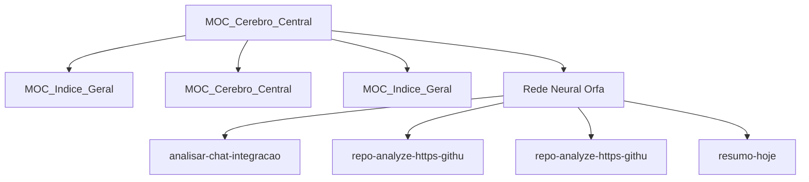

# 🧠 Tronco Cerebral — Núcleo do Segundo Cérebro

Hub central LYT autogerado pelo `brain_synapse.py`. Este nó ancora o Graph View
e concentra a densidade de conexões neurais do cofre `Memoria_Agente/`.

**Última sincronização neural:** 2026-06-27 03:25 UTC
**Total de notas:** 76
**Auto-sinapses geradas nesta execução:** 9
**Regras de matching ativas:** 199

## Núcleo — Mapas de Conteúdo (MoCs)

- [[00_NOTEBOOK_MESTRE_JAVVIS]]
- [[MOC_Indice_Geral]]
- [[MOC_Cerebro_Central]]

## Pilares LYT

- [[Hermes]] — 💡 Conceitos
- [[Hermes]] — 📋 Decisões
- [[Hermes]] — ⚠️ Armadilhas
- [[Hermes]] — 🗂️ Sessões
- [[Hermes]] — 🚀 Bootstrap

## Aglomerados Neurais

### 💡 Cluster — Conceitos (33)

- [[MCPs]]
- [[Mem]]
- [[Mem]]
- [[GLM]]
- [[Mem]]
- [[Mem]]
- [[Hermes]]
- [[Hermes]]
- [[Hermes]]
- [[Hermes]]
- [[Mem]]
- [[Mem]]
- ... +21 notas

### 📋 Cluster — Decisões (4)

- [[Hermes]]
- [[Hermes]]
- [[Mem]]
- [[Git]]

### ⚠️ Cluster — Gotchas (5)

- [[Hermes]]
- [[Mem]]
- [[Git]]
- [[Hermes]]
- [[Hermes]]

### 🗂️ Cluster — Sessões (26)

- [[Hermes]]
- [[Hermes]]
- [[Hermes]]
- [[Hermes]]
- [[YouTube_SmYQcaP1Jgw]]
- [[Hermes]]
- [[Hermes]]
- [[Hermes]]
- [[Hermes]]
- [[Hermes]]
- [[Hermes]]
- [[Hermes]]
- ... +14 notas

## Rede Neural Órfã

Notas sem conexões de entrada **e** saída — forçadas a ancorar neste tronco:

- [[Hermes]] — analisar_chat integracao bot
- [[Git]] — repo_analyze https---github.com-arxhr007-Aliens_eye
- [[Git]] — repo_analyze https---github.com-ShadowHackrs-gmail-account-creator
- [[Hermes]] — resumo_hoje

## Grafo Neural (Mermaid)

