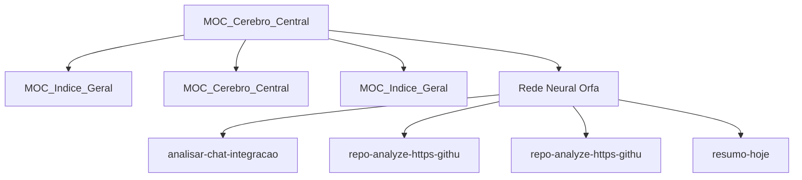

# 🧠 Tronco Cerebral — Núcleo do Segundo Cérebro

Hub central LYT autogerado pelo `brain_synapse.py`. Este nó ancora o Graph View
e concentra a densidade de conexões neurais do cofre `Memoria_Agente/`.

**Última sincronização neural:** 2026-06-27 03:25 UTC
**Total de notas:** 76
**Auto-sinapses geradas nesta execução:** 9
**Regras de matching ativas:** 199

## Núcleo — Mapas de Conteúdo (MoCs)

- [[MOC_Indice_Geral]]
- [[MOC_Cerebro_Central]]

## Pilares LYT

- [[telegram-hermes/concepts]] — 💡 Conceitos
- [[telegram-hermes/decisions]] — 📋 Decisões
- [[telegram-hermes/gotchas]] — ⚠️ Armadilhas
- [[telegram-hermes/sessions]] — 🗂️ Sessões
- [[telegram-hermes/bootstrap]] — 🚀 Bootstrap

## Aglomerados Neurais

### 💡 Cluster — Conceitos (33)

- [[telegram-hermes/concepts/ai-memory-mcp-server]]
- [[telegram-hermes/concepts/akita-deep-summary-ai-memory-memoria-de-longo-prazo-karpathy-wiki-e-auto]]
- [[telegram-hermes/concepts/akita-deep-summary-ai-memory-memoria-de-longo-prazo-karpathy-wiki-e-auto-2]]
- [[telegram-hermes/concepts/akita-deep-summary-llm-benchmark-kimi-v2-7-code-glm-5-2-minimax-m3-local]]
- [[telegram-hermes/concepts/akita-deep-summary-reduce-ai-memory-memoria-de-longo-prazo-karpathy-wiki]]
- [[telegram-hermes/concepts/akita-podcast-ai-memory-memoria-de-longo-prazo-karpathy-wiki-e-auto-apre]]
- [[telegram-hermes/concepts/akita-youtube-and-article-processing]]
- [[telegram-hermes/concepts/analisar-chat-integracao-bot]]
- [[telegram-hermes/concepts/langgraph-stateful-agents]]
- [[telegram-hermes/concepts/progress-feedback]]
- [[telegram-hermes/concepts/repo-analyze-https-github-com-akitaonrails-ai-memory]]
- [[telegram-hermes/concepts/repo-analyze-https-github-com-deusdata-codebase-memory-mcp]]
- ... +21 notas

### 📋 Cluster — Decisões (4)

- [[telegram-hermes/decisions/0001-guard-startup-with-venv-and-single-instance-protection]]
- [[telegram-hermes/decisions/0002-use-fail-safe-disablement-for-missing-repo-analyze]]
- [[telegram-hermes/decisions/0003-expose-ai-memory-remotely-with-layered-access-controls]]
- [[telegram-hermes/decisions/repo-analyze-https-github-com-arxhr007-aliens-eye]]

### ⚠️ Cluster — Gotchas (5)

- [[telegram-hermes/gotchas/dynamic-timeouts-for-youtube-processing]]
- [[telegram-hermes/gotchas/memory-file-truncation]]
- [[telegram-hermes/gotchas/repo-analyze-https-github-com-shadowhackrs-gmail-account-creator]]
- [[telegram-hermes/gotchas/resumo-hoje]]
- [[telegram-hermes/gotchas/router-wiring-can-hide-existing-commands]]

### 🗂️ Cluster — Sessões (26)

- [[telegram-hermes/sessions/entao-ser-ey-prefiro-perder-tempo-com-alguma-atividade-que-a-ia-faria-em]]
- [[telegram-hermes/sessions/name-ssid]]
- [[telegram-hermes/sessions/persona-youtube-https-youtu-be-o68y0yrzl1y-is-twan4f0lkvyqgma]]
- [[telegram-hermes/sessions/persona-youtube-https-youtu-be-o68y0yrzl1y-is-twan4f0lkvyqgma-m-203853]]
- [[telegram-hermes/sessions/persona-youtube-https-youtu-be-smyqcap1jgw-is-ek1aanbnhvopqzb]]
- [[telegram-hermes/sessions/persona-youtube-https-youtu-be-yl-hlwhj2b0-is-eo-nde824ht2r8u0]]
- [[telegram-hermes/sessions/resumo-hoje]]
- [[telegram-hermes/sessions/resumo-hoje-e-194640]]
- [[telegram-hermes/sessions/resumo-hoje-e-195033]]
- [[telegram-hermes/sessions/youtube-https-youtu-be-wahgleinmmk-is-gxz0ceqr3ckvaofg]]
- [[telegram-hermes/sessions/youtube-https-youtu-be-wahgleinmmk-is-gxz0ceqr3ckvaofg-g-135852]]
- [[telegram-hermes/sessions/youtube-https-youtu-be-wahgleinmmk-is-gxz0ceqr3ckvaofg-g-135955]]
- ... +14 notas

## Rede Neural Órfã

Notas sem conexões de entrada **e** saída — forçadas a ancorar neste tronco:

- [[telegram-hermes/concepts/analisar-chat-integracao-bot]] — analisar_chat integracao bot
- [[telegram-hermes/decisions/repo-analyze-https-github-com-arxhr007-aliens-eye]] — repo_analyze https---github.com-arxhr007-Aliens_eye
- [[telegram-hermes/gotchas/repo-analyze-https-github-com-shadowhackrs-gmail-account-creator]] — repo_analyze https---github.com-ShadowHackrs-gmail-account-creator
- [[telegram-hermes/gotchas/resumo-hoje]] — resumo_hoje

## Grafo Neural (Mermaid)

