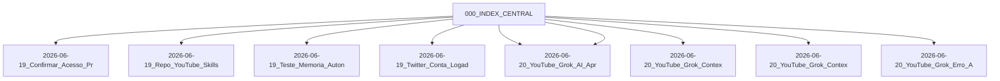

# Índice Central — Memoria Agente

Mapa de Conteúdo (MoC) autogerado pelo agente SRE. Todos os nós linkam de volta para este índice.

**Última reorganização:** 2026-06-20 06:17 UTC
**Total de notas:** 9

## 🐦 Twitter / Social

- [[2026-06-19_Twitter_Conta_Logada]] — `2026-06-19_Twitter_Conta_Logada.md`

## 🧪 Testes e Validação

- [[2026-06-19_Teste_Memoria_Autonoma]] — `2026-06-19_Teste_Memoria_Autonoma.md`

## ⚠️ Resolução de Erros

- [[2026-06-20_YouTube_Grok_Erro_API]] — `2026-06-20_YouTube_Grok_Erro_API.md`
- [[2026-06-20_YouTube_Grok_Contexto_v1]] — `2026-06-20_YouTube_Grok_Contexto_v1.md`
- [[2026-06-20_YouTube_Grok_AI_Aprendizado_v1]] — `2026-06-20_YouTube_Grok_AI_Aprendizado_v1.md`
- [[2026-06-19_Repo_YouTube_Skills]] — `2026-06-19_Repo_YouTube_Skills.md`

## 💬 Memória Geral

- [[2026-06-20_YouTube_Grok_Contexto_v2]] — `2026-06-20_YouTube_Grok_Contexto_v2.md`
- [[2026-06-20_YouTube_Grok_AI_Aprendizado_v2]] — `2026-06-20_YouTube_Grok_AI_Aprendizado_v2.md`
- [[2026-06-19_Confirmar_Acesso_Projeto]] — `2026-06-19_Confirmar_Acesso_Projeto.md`

## Grafo

<!-- memoria-agente-graph -->
**Índice:** [[000_INDEX_CENTRAL]]

#hermes #index #memoria-agente #moc
<!-- /memoria-agente-graph -->