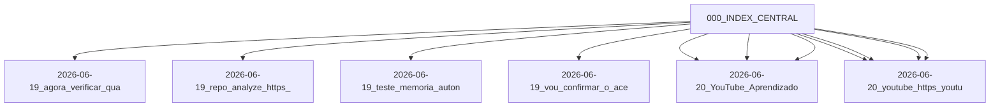

# Índice Central — Memoria Agente

Mapa de Conteúdo (MoC) autogerado pelo agente SRE. Todos os nós linkam de volta para este índice.

**Última reorganização:** 2026-06-20 06:09 UTC
**Total de notas:** 11

## 📦 Repositórios

- [[2026-06-19_repo_analyze_https_github_com_zeropointrepo_youtube_skills_233418]] — `2026-06-19_repo_analyze_https_github_com_zeropointrepo_youtube_skills_233418.md`

## 📺 YouTube

- [[2026-06-20_youtube_https_youtu_be_tairq97g7ow_is_qfyjooi2uowguuq5_055904]] — `2026-06-20_youtube_https_youtu_be_tairq97g7ow_is_qfyjooi2uowguuq5_055904.md`
- [[2026-06-20_youtube_https_youtu_be_tairq97g7ow_is_qfyjooi2uowguuq5_055901]] — `2026-06-20_youtube_https_youtu_be_tairq97g7ow_is_qfyjooi2uowguuq5_055901.md`
- [[2026-06-20_youtube_https_youtu_be_tairq97g7ow_is_qfyjooi2uowguuq5_054907]] — `2026-06-20_youtube_https_youtu_be_tairq97g7ow_is_qfyjooi2uowguuq5_054907.md`
- [[2026-06-20_youtube_https_youtu_be_tairq97g7ow_is_qfyjooi2uowguuq5_054902]] — `2026-06-20_youtube_https_youtu_be_tairq97g7ow_is_qfyjooi2uowguuq5_054902.md`
- [[2026-06-20_YouTube_Aprendizado_TAirq97G7ow_055901]] — `2026-06-20_YouTube_Aprendizado_TAirq97G7ow_055901.md`
- [[2026-06-20_YouTube_Aprendizado_TAirq97G7ow_054902]] — `2026-06-20_YouTube_Aprendizado_TAirq97G7ow_054902.md`
- [[2026-06-20_YouTube_Aprendizado_TAirq97G7ow_052657]] — `2026-06-20_YouTube_Aprendizado_TAirq97G7ow_052657.md`

## 🐦 Twitter / Social

- [[2026-06-19_agora_verificar_qual_conta_do_twitter_ta_logada_184615]] — `2026-06-19_agora_verificar_qual_conta_do_twitter_ta_logada_184615.md`

## 🧪 Testes e Validação

- [[2026-06-19_teste_memoria_autonoma_074259]] — `2026-06-19_teste_memoria_autonoma_074259.md`

## 💬 Memória Geral

- [[2026-06-19_vou_confirmar_o_acesso_ao_projeto_e_responder_ao_seu_teste_195743]] — `2026-06-19_vou_confirmar_o_acesso_ao_projeto_e_responder_ao_seu_teste_195743.md`

## Grafo

<!-- memoria-agente-graph -->
**Índice:** [[000_INDEX_CENTRAL]]

#hermes #index #memoria-agente #moc
<!-- /memoria-agente-graph -->